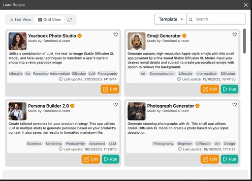
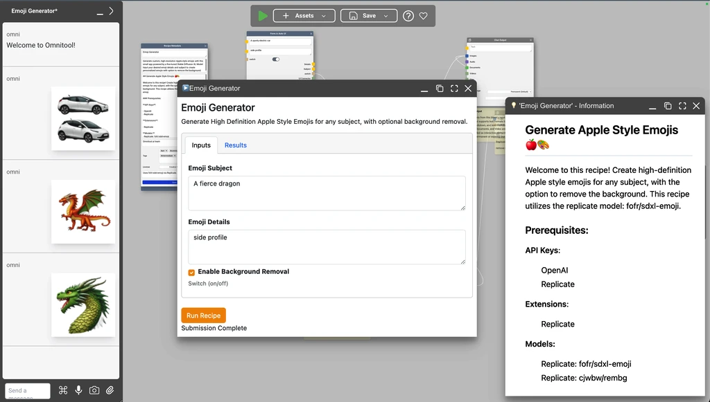
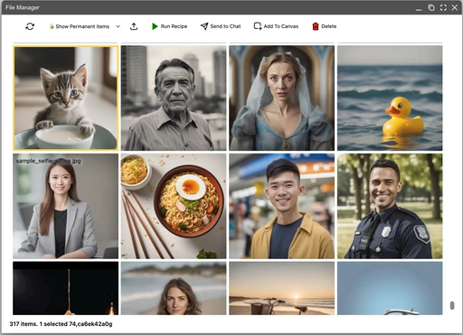
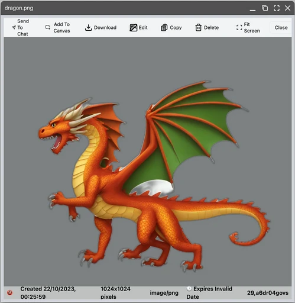

# Omnitool.ai - Your Open Source AI Desktop

*Discover, Learn, Evaluate and Build with thousands of Generative AI Models.*

Omnitool.ai is an open-source, downloadable "AI Lab in a box" built for learners, enthusiasts and anyone with interest in the current wave of AI innovation. It provides an extensible browser based desktop environment for streamlined, hands-on interacting with the latest AI models from OpenAI, replicate.com, Stable Diffusion, Google, or other leading providers through a single, unified interface.

<p align="center">
  
  
  
  
  
</p>

## Why Omnitool?

With thousands of preprints and countless "AI tools" released each week, it is incredibly challenging to stay on top of the rapidly evolving AI ecosystem, to separate hype and facts and to extract durable long term skills and learning. PapersWithCode and Github repositories attached to ArxIV papers provide ability to hands-on validate and apply the latest discoveries, but the fragile nature of the Python ecosystem and often steep hardware requirments dramatically limits accessibility. Likewise implementing and testing cloud based models requires delving deep into API documentation and wrestling with connecting code.

We believe that is a serious problem. AI may represent the first large scale technological disruption unbounded by logistical challenges, scaling along existing wires, API infastructure and app delivery platforms. Meanwhile, market pressure to adopt AI is felt by many   businesses and teams. 

Without educated decision makers and technical experts,  businesses and public organisations alike are at high risk of falling for hype and magical narratives and expensive misadventures.      

Omnitool is our attempt to improve this situation: A **single, unified interface** capable of connecting with as many AI models as possible and to **reduce the "time to hands on AI" to an absolute minimum**. 

Omnitool is **highly extensible and interoperable**. Most OpenAPI3 based services can be connected and turned into "blocks" without writing code. It's extension framework enables deeper integrations of anything from custom UIs (Like Stability Dream Studio) to Game Engines (like BabyonJS or Phaser) to [Image manipulation libraries](https://github.com/georgzoeller/omni-extension-sharp/blob/master/README.md).


## What Omnitool is NOT

- Omnitool is **not a multi-user cloud SaaS product**. It's a downloadable, locally installed product. 
- Omnitool is **NOT a no-code solution** meant to replace coding or enable non engineers to code. It's focused on interacting with AI use cases, not writing general purpose software.
- Omnitool is **not production/enterprise software**. (Yet.) It's a lab optimizing for access to the latest technologies over stability and, as with any lab, things may blow up from time to time.  
   

## Table of Contents

- [Key Features](#key-features)
- [Quickstart](#quickstart-guide)
- [Manual Install](#manual-install)
- [PocketBase DB Admin (ADVANCED)](#pocketbase-db-admin-advanced)
- [Next Steps](#next-steps)
- [Changelist](#changelist)

## Key Features

### Comprehensive AI Provider Support
* Seamlessly integrates with leading AI providers including OpenAI, replicate.com, Stable Diffusion, Google, and many more.

## Local Infrastructure Compatibility
* Easily integrate with local AI infrastructure, including servers on your local network or even large language models running on your machine.

## Extensible Architecture
* A robust extensions mechanism allows for vertical integrations with specific AI providers, specialized focus on certain media types like image flipbooks, or additional recipe support such as integrated image editing (via minipaint) or audio editing (via wavacity).

## Open Source Commitment
* Omnitool.ai is fully committed to the ethos of open-source development. You have complete access to the source code for educational, research, and further development purposes.

## Quickstart Guide

We are currently testing installers for Windows and macOS. Until those are publicly available, please follow the manual installation steps.

## Manual Install

This guide will help you download the Omnitool software, and then build and start the Omnitool server in a directory running from your local machine.

You can then access the Omnitool software from a web browser on your local machine.

1. **Prerequisites**

  Ensure you have the latest versions of the following sofware installed:

 * [Node.js](https://nodejs.org/en)
 * [Yarn](https://yarnpkg.com)
 * [Git](https://en.wikipedia.org/wiki/Git)


2. **Get the Source Code**
 - Open a terminal
 - Navigate to where you want Omnitool to be installed 
 - Use the following command:
  ```
    git clone https://github.com/omnitool-ai/omnitool
  ```

  This will create the `omnitool` folder.  

  - Now navigate inside Omnitool's folder. By default:
  ```
    cd omnitool
  ```

3. **Install Source Dependencies**

  Run the following command in the root of the repository to install the necessary dependencies:
  ```
    yarn install
  ```

4. **Build and Start the Server**

  Now we will use `yarn` and `Node.js` to build the server software locally on your machine and then start it running.

  ```
    yarn start
  ```

  When successful, you will see the following message:

  ```
◐ Booting Server
✔ Server has started and is ready to accept connections on http://127.0.0.1:1688.
✔ Ctrl-C to quit.
```

5. **Open Omnitool in a Web Browser**

  Omnitool.ai can now be accessed from:
  [127.0.0.1:1688](http://127.0.0.1:1688)  

---
6. **Explore the Sample Recipes**
  Use the "Load Recipe" button in the menu to explore different functionality of the platform.

---
7. **Explore the Code**
  For a list of scripts we use internally, try running:
  ```
    yarn run
  ```

## PocketBase DB Admin (ADVANCED)
Recipes and various cache data are stored in a [PocketBase](https://pocketbase.io) database.

If the database is currently running, you can access the default PocketBase admin interface by navigating to [127.0.0.1:8090/_](http://127.0.0.1:8090/_)

Alternatively, the admin interface can be accessed directly within omnitool. From the main menu, choose the `Database Admin` option and the same interface will open inside the omnitool browser window.

o log in to the database, use the credentials
 * Email: **admin@local.host**
 * Password: **admin@local.host**

Once logged in, you can directly modify records using the PocketBase admin interface. This is particularly useful for advanced configurations and troubleshooting.

### Reset Local PocketBase Storage (ADVANCED)

There may be occasions when you need to reset your local database, either to recover from an invalid state or to start with a fresh install.

For Linux:
   ```bash
   rm -rf ./local.bin
   yarn start
   ```
For Windows:
  ```cmd
  rmdir /s /q .\local.bin
  yarn start
  ```

- **Warning**:
  - **ALL YOUR LOCAL RECIPES, GENERATED IMAGES, DOCUMENTS, AUDIO ETC, WILL BE PERMANENTLY ERASED**

## Generating a JWT Token

Our service allows you to generate a JWT by running a specific script designed for this purpose. The script's signature is as follows:

```
/generateJwtToken <action> <subject> <expires_in>
```

**Parameters**

- `<action>`: This is a string parameter identifying the intended action to be performed. In the context of running recipes, this should be set to exec.
- `<subject>`: This is a string parameter that specifies the subject of the JWT. This could be the recipe that you intend to execute.
- `<expires_in>`: This is an integer parameter that determines the token's validity period in milliseconds.

**Example**

To generate a JWT for executing a recipe with a validity of 30,000 milliseconds (or 30 seconds), you would run the following script:

```
/generateJwtToken exec Workflow 30000
```

**Output**

The script will output a JWT, which is a token string to be used in the authorization header for your API requests.

### Executing a recipe with JWT Authentication

Once you have your JWT, you can execute a recipe by making a POST request to the recipe execution API. This request must include the JWT in the Authorization header.

**Endpoint**

```
POST http://127.0.0.1:1688/api/v1/workflow/exec
```

**Header**

```
Authorization: Bearer <token>
```

`<token>` is the JWT acquired from the /generateJwtToken script.

**Curl Example**

To make the request using curl, you would use the following command, replacing <token> with your actual JWT:

```
curl -X POST http://127.0.0.1:1688/api/v1/workflow/exec -H "Authorization: Bearer <token>"
```

**Response**

Upon success, the API will initiate the specified recipe. You will receive a JSON response containing details about the recipe's execution status, including any outputs or errors.

**Security Considerations**

- Keep your JWT secure to prevent unauthorized access to your recipes.
- Always use a secure connection to interact with the APIs.
- Regularly rotate your tokens and use a short expiration time to minimize the impact of potential leaks.

**Troubleshooting**

If you encounter authorization errors, ensure the JWT has not expired, is correctly set in the header, and was generated with the proper parameters.

## Next Steps

1. Join the Omnitool.ai Discord Community

Interact with fellow users, share your experiences, ask questions, and be a part of our active and growing community on [Discord](https://tinyurl.com/omnitool-discord).

2. Contribute to Omnitool.ai

As an open-source platform, we welcome contributions from users like you. Whether it's improving documentation, adding new features, or simply sharing your unique use cases, your input is invaluable to us. Simply send us a pull-request and we'll be in contact.

3. Feedback and Suggestions

Your feedback helps shape the future of Omnitool.ai. Send your feedback and suggestions to [support@omnitool.ai](mailto:support@omnitool.ai), or share them directly in our [Discord #feedback channel](https://tinyurl.com/omnitool-feedback). 

## Changelist

 * Version 0.5.0, 2023-10

   Initial release with support for recipes and multiple API providers include OpenAI, replicate.com and ElevenLabs.
