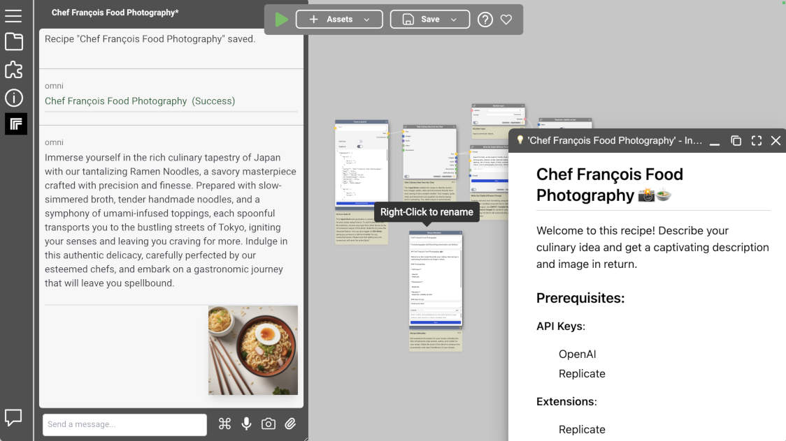

# Omnitool.ai - Your Open Source AI Desktop
Discover, Learn, Evaluate and Build with thousands of Generative AI Models.

Omnitool.ai is an open-source, state-of-the-art orchestration AI engine built for efficiently managing and optimizing complex recipes across a multitude of AI providers.
Whether you're leveraging services from OpenAI, replicate.com, Stable Diffusion, Google, or other leading providers, Omnitool.ai ensures seamless integration and streamlined operation.



## Table of Contents

- [Key Features](#key-features)
- [Quickstart (Mac)](#quickstart-using-install-scripts-mac)
- [Quickstart (Windows)](#quickstart-using-install-scripts-windows)
- [Manual Quickstart](#manual-quickstart)
- [PocketBase DB Admin (ADVANCED)](#pocketbase-db-admin-advanced)
- [Next Steps](#next-steps)
- [Changelist](#changelist)


## Key Features

### Comprehensive AI Provider Support
* Seamlessly integrates with leading AI providers including OpenAI, replicate.com, Stable Diffusion, Google, and many more.

## Local Infrastructure Compatibility
* Easily integrate with local AI infrastructure, including servers on your local network or even large language models running on your machine.

## Extensible Architecture
* A robust extensions mechanism allows for vertical integrations with specific AI providers, specialized focus on certain media types like image flipbooks, or additional workflow support such as integrated image editing (via minipaint) or audio editing (via wavacity).

## Enterprise Readiness
* For our enterprise customers, extensions can deliver granular control over aspects like billing, copyright, usage limits, privacy, as well as NSFW detection and monitoring. For more information, please contact us to discuss how we can best serve your specific needs.

## Open Source Commitment
* Omnitool.ai is fully committed to the ethos of open-source development. You have complete access to the source code for educational, research, and further development purposes.

## Quickstart
Ensure you have the latest [Node.js](https://nodejs.org/en) and [Yarn](https://yarnpkg.com/) installed. You can launch Omnitool.ai by following these steps after cloning the repository:

1. **Install Dependencies**

  Run the following command in the root of the repository to install the necessary dependencies:
  ```
    yarn install
  ```

2. **Start the Server in Local Mode**

  Execute the following command to start the Omnitool.ai. Your browser will open automatically once the setup is complete:

  ```
    yarn start
  ```

3. **Open Web Interface**

  You can always reopen the tool in another browser by navigating to the specified local address to access the Omnitool.ai.

  Omnitool.ai can now be accessed from [127.0.0.1:1688](http://127.0.0.1:1688)

4. **Explore the sample recipes**

  Use the "Load Recipe" button in the menu to explore different functionality of the platform.

5. **Explore the Code**

  For a list of scripts we use internally, try running:
  ```
    yarn run
  ```


## PocketBase DB Admin (ADVANCED)
Recipes and various cache data are stored in a [PocketBase](https://pocketbase.io) database.

If the database is currently running, you can access the default PocketBase admin interface by navigating to [127.0.0.1:8090/_](http://127.0.0.1:8090/_)

Alternatively, the admin interface can be accessed directly within omnitool. From the main menu, choose the `Database Admin` option and the same interface will open inside the omnitool browser window.

o log in to the database, use the credentials
 * Email: **admin@local.host**
 * Password: **admin@local.host**

Once logged in, you can directly modify records using the PocketBase admin interface. This is particularly useful for advanced configurations and troubleshooting.

### Reset Local PocketBase Storage (ADVANCED)

There may be occasions when you need to reset your local database, either to recover from an invalid state or to start with a fresh install.

For Linux:
   ```bash
   rm -rf ./local.bin
   yarn start
   ```
For Windows:
  ```cmd
  rmdir /s /q .\local.bin
  yarn start
  ```

## Generating a JWT Token

Our service allows you to generate a JWT by running a specific script designed for this purpose. The script's signature is as follows:

```
/generateJwtToken <action> <subject> <expires_in>
```

**Parameters**

- `<action>`: This is a string parameter identifying the intended action to be performed. In the context of running workflows, this should be set to exec.
- `<subject>`: This is a string parameter that specifies the subject of the JWT. This could be the workflow that you intend to execute.
- `<expires_in>`: This is an integer parameter that determines the token's validity period in milliseconds.

**Example**

To generate a JWT for executing a workflow with a validity of 30,000 milliseconds (or 30 seconds), you would run the following script:

```
/generateJwtToken exec Workflow 30000
```

**Output**

The script will output a JWT, which is a token string to be used in the authorization header for your API requests.

### Executing a Workflow with JWT Authentication

Once you have your JWT, you can execute a workflow by making a POST request to the workflow execution API. This request must include the JWT in the Authorization header.

**Endpoint**

```
POST http://127.0.0.1:1688/api/v1/workflow/exec
```

**Header**

```
Authorization: Bearer <token>
```

`<token>` is the JWT acquired from the /generateJwtToken script.

**Curl Example**

To make the request using curl, you would use the following command, replacing <token> with your actual JWT:

```
curl -X POST http://127.0.0.1:1688/api/v1/workflow/exec -H "Authorization: Bearer <token>"
```

**Response**

Upon success, the API will initiate the specified workflow. You will receive a JSON response containing details about the workflow's execution status, including any outputs or errors.

**Security Considerations**

- Keep your JWT secure to prevent unauthorized access to your workflows.
- Always use a secure connection to interact with the APIs.
- Regularly rotate your tokens and use a short expiration time to minimize the impact of potential leaks.

**Troubleshooting**

If you encounter authorization errors, ensure the JWT has not expired, is correctly set in the header, and was generated with the proper parameters.

- **Warning**:
  - **ALL YOUR LOCAL RECIPES, GENERATED IMAGES, DOCUMENTS, AUDIO ETC, WILL BE PERMANENTLY ERASED**


## Next Steps

1. Join the Omnitool.ai Discord Community

Interact with fellow users, share your experiences, ask questions, and be a part of our active and growing community on [Discord](https://tinyurl.com/omnitool-discord).

2. Contribute to Omnitool.ai

As an open-source platform, we welcome contributions from users like you. Whether it's improving documentation, adding new features, or simply sharing your unique use cases, your input is invaluable to us. Simply send us a pull-request and we'll be in contact.

3. Feedback and Suggestions

Your feedback helps shape the future of Omnitool.ai. Send your feedback and suggestions to [support@omnitool.ai](mailto:support@omnitool.ai)

## Changelist

 * Version 0.5.0, 2023-10

   Initial release with support for recipes and multiple API providers include OpenAI, replicate.com and ElevenLabs.
